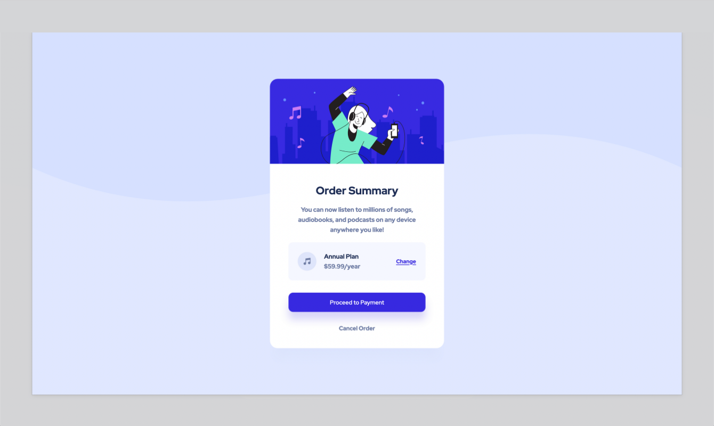

# Order Summary

## Table of contents

- [Overview](#overview)
  - [Screenshot](#screenshot)
  - [Live Page](#live-page)
  - [Built with](#built-with)
- [Author](#author)

## Overview

This is a solution to the [Order summary component on Frontend Mentor](https://www.frontendmentor.io/challenges/order-summary-component-QlPmajDUj).

### Screenshot

### Live Page

A live version of this repo can be found [here](https://chekhhovs-func.github.io/order-summary).

### Built with

- [React](https://reactjs.org/) - JS library
- [SCSS](https://sass-lang.com/) - For styles
- HTML5
- Mobile-first workflow

## Author

- Github - [Robert Butler](https://github.com/chekhovs-func)
